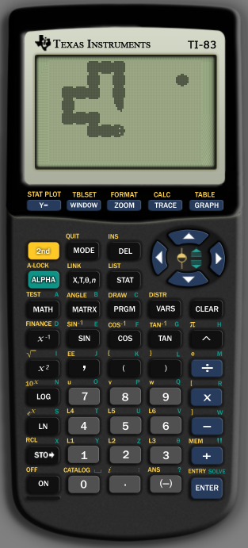

# ti83-snake
This is yet another Snake for TI-83 written in Z80 assembler.



## Installation
Copy `snakeFixed.83p` to a TI-83 emulator or to a real TI-83. See https://github.com/jw0k/serial2ti83 for instructions on how to connect a TI-83 to a computer.
## Running
Type `Send(9prgmSNAKE` to run the game and start playing.
## Assembling the source code
Use `spasm-ng` to assemble the code:
```
$spasm snake.asm snake.83p
```
If you use older version of `spasm-ng`, run:
```
$python fix83p.py snake.83p snakeFixed.83p
```
If you have the newest version of `spasm-ng` skip this step.
